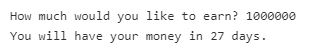

# DangerousWork.java
You have decided to take on some very dangerous work with some rather strange payment.
 For each day you stay at the work, the salary is doubled -- it will begin with 0.01
 the first day and it will be 0.02 the second, 0.04 the third, 0.08 the fourth and 
so on. DangerousWork.java helps you calculate the minimum number of days you need to
 work to earn a specific amount, you should keep in mind that you probably won't survive working more than 30 days... 
See an example of the program running below:

