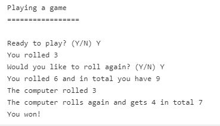

# Hitanine.java
The game works as follows. Both you and the computer have two possible dice to roll. 
First you roll a die and then decide if you would like to roll another. When you are done, that is if you decide to roll 
another or to skip the second roll, it is time for the computer to do the same. The computer rolls the first die and if it is four or lower, it will roll anther, otherwise it will skip the second roll.
When both players have done their rolls, the program should calculate who, if anyone, won. As stated, the one closest to nine wins, unless it is ten or more. If either player gets ten or more, the player is declared "fat" 
and automatically loses.

