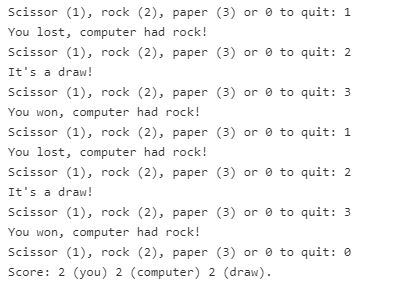

# GameSRP.java
It plays the popular scissor-rock-paper game where a scissor can cut paper, a rock
can nock a scissor and a paper can wrap a rock. The program asks the user for one of
 the options (1 for scissor, 2 for rock or 3 for paper) and then randomly picks one 
of them for the computer. It then presents if you or the computer won, or if it was 
a draw. If the user enters 0 the program will end and display the total score 
(number of wins for you and the computer and the draws).
Here is a sample run:
An example of an execution:
