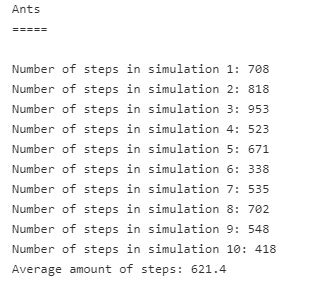

# ants.java
Imagine a chess board and an ant. The ant is randomly put on the board and after that
 it can walk up, down, left and right (not diagonally). The ant cannot walk over the 
edge of the chess board (if it tries, it is not counted as a movement -- see it as a
 wall around the chess board). Ants.java  simulates the walking over the chess board 
of an ant. To walk to another square than the one the ant is currently on is called a "step" (even though it will take the 
ant several steps to move...). Each simulation should calculate the number of "steps"
 the ant takes to visit all squares on the chess board. The simulations  done 
ten times and an average calculated at the end of the simulation. 
An example run of the simulation is shown below: 

